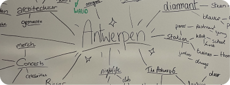
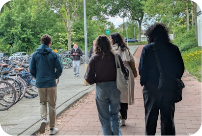
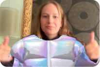
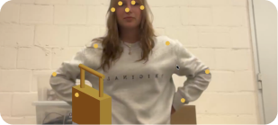
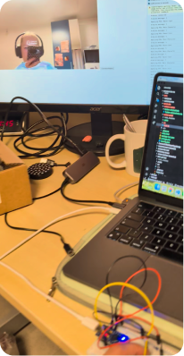

import antwerpVideo from '../../assets/videos/AntwerpPOV-portfolio.mp4?url';
import arrowIcon from "../../assets/icons/arrow-pr-button.svg";

# The briefing

I did not do this project alone, i had 3 teammates from Devine. 
The first week of this project was in teamwork with the students of Rotterdam CMI, so that week we were in a team of 6 people. We all gathered in Rotterdam to get the brief from the client:  Visit Antwerp. 

## The challenge
Convince more ’young urban travelers’ (aged 18–36) to choose Antwerp for a (multi-day) city trip. 

## Sub challenges

- Place one of these main themes at the core of the concept: city by the river, style, flavour, 24/7 pulse and historic heart with modern beat

- Clearly connect with the mindset of gen-z, zillennial and/or millennials, we focussed on connecting to the mindset of gen-z.

- The concept should contain 2 out of 3: a digital application, a physical activation and / or a social media format or campaign concept

# The process

## Concept

The first week with the Rotterdam students was all about finding a concept. We hit the streets of Rotterdam to interview our target audience (gen-z). These conversations were to find the direction we wanted to head in for the final result. 

After forming a how might we question, we brainstormed and brainstormed. It took us a some time to come up with our final concept but after a while AntwerPOV was formed. 

Simply explained, the idea was to have an installation that shows you in one of Antwerps stereotype point of views by placing you in front of the camera wearing 3D AR items fitting with that stereotype. It comes with a website on which you can be featured and explains the whole campaign.

<a
  class="project__button--content"
  href="https://www.behance.net/gallery/251436611/AntwerPOV" >
  UX process site
  
</a>

## Research

The concept took on many forms throughout our process, changing depending on technical limitations, new findings and more. 

We did interviews and a survey to find out what stereotypes of Antwerp are most widely known. The idea became more clear and that is when we all had our own task. I was in charge of the analytical parts of UX like the wireframes and figuring out the data. At the same time my teammate Bryan I also started experimenting with softwares and other technology to see what would work best for the installation and for the website.

  ## Installation

  

  

  

  In the middle of the project, the installation was my main priority. One of my teammates made all the 3D items while i put the installation together technically. I tried out many different options for the AR but ended up using Snapchat Studio Lens. It was really fun to learn a new software. 

  I think the most difficult part of this was communicating with the lens. I didn’t spend to long figuring out the webRTC part and getting the snapchat lenses in the browser, but what we also needed was to be able to toggle extra items to the lens via the browser. I knew it had to be possible so kept on trying and figured it out eventually. 

  After the installation was almost done technically, all that needed to happen was to make the final lenses in lens studio and puzzle all the technical pieces together.

  <a
    class="project__button--content"
    href="https://www.figma.com/board/SfhQOq8vWL0AuCFqQ8dFfX/AntwerPOV---Dev-process?node-id=0-1&t=8RYfgSmztWoPG2iB-1" >
    Development process
    
  </a>

## Final pieces

After the installation was done, I helped my teammates here and there, like the UX process site and the coding of the campaign website. 

# The result

## Final concept

AntwerPOV is an interactive campaign that uses Antwerps most known stereotypes as point of views. With an interactive installation on the streets of Belgiums cities, people are placed in a point of view by seeing themselves wear items fitting the stereotype. They can discover Antwerp through the eyes of those types. 

There is a total of 7 stereotypes, but due to time we were only able to make lenses for 3 of them. We did work out routes and all information for all seven (see UX process site). 

## Installation

The installation consists out of two parts: an iPad and the screen itself. This installation places the user in the point of view of an Antwerp stereotype. There is also a pedal attached that can be used to switch between pov’s. With the iPad, the user can customise the point of view: how do you see Antwerp?

<video class="antwerp__video" width="695" height="334" controls>
 <source src={antwerpVideo} />
</video>

## Campaign website

On the campaign website, people can find information about the campaign and each stereotype. They can also land on the routes page via the qr code on the installation. If they capture an image of themselves and check ‘feature me’ their image will appear on the website via our Supabase database. Sadly we don’t have pro so the database is now paused. 

The campaign website is made with Astro with a React island for the dynamic captured images. Meaning if you take an image from the installation it will immediately appear on the website.

<a
  class="project__button--content project__button--content--last"
  href="https://matteojacobs.github.io/integration-04/" >
  Campaign website
  
</a>