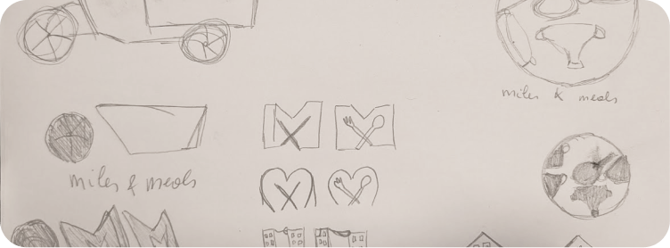
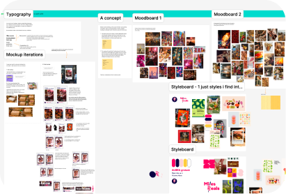
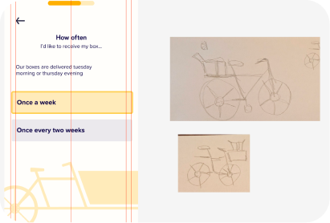
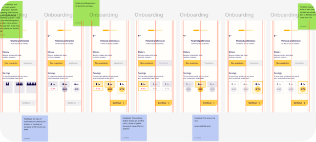
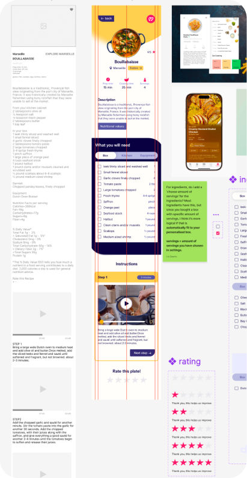
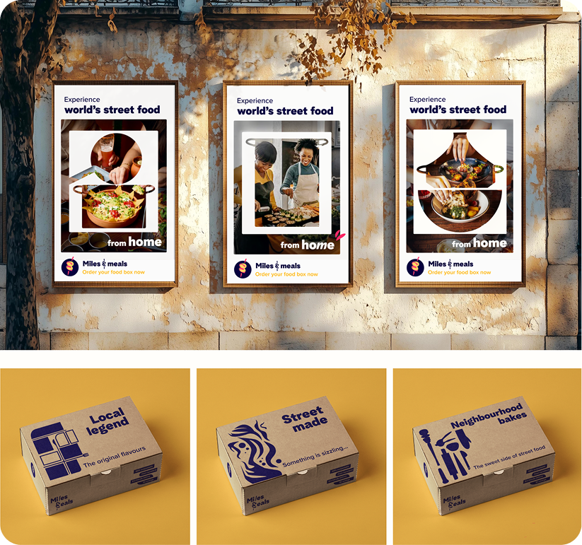
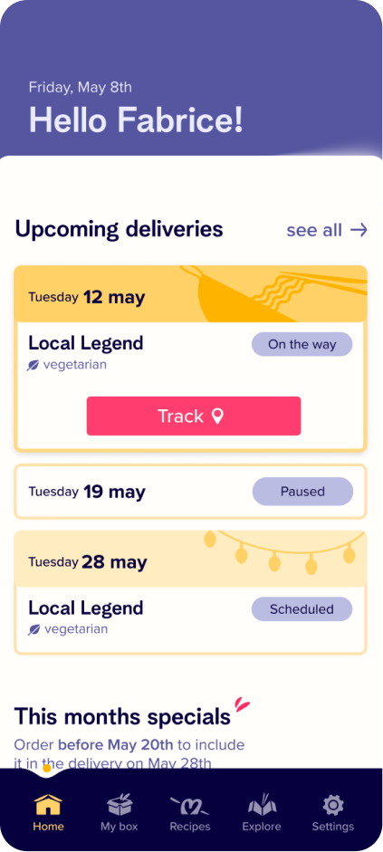
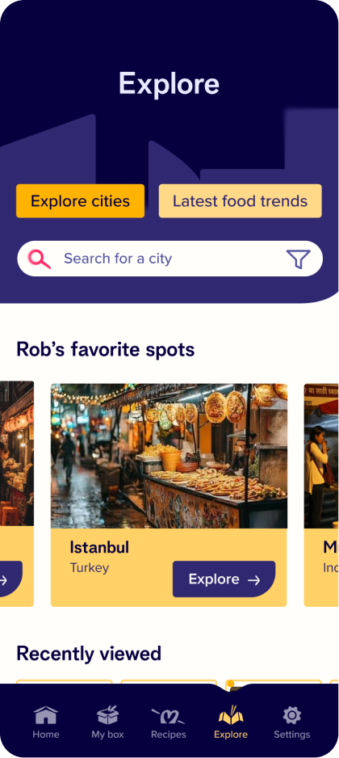

import arrowIcon from "../../assets/icons/arrow-pr-button.svg";

# The briefing

## Part 1: brand board
This assignment consisted out of two parts. For the first part we needed to design the brand identity for Miles & Meals. The brand identity should fit the core values of the client and is appealing for the target audience. Things like brand core values, tone of voice, logo, colour, typography, ... had to be designed

## Part 2: app design

After making the brand board for Miles & Meals, the challenge was to design the app with the brand identity we created ourselves. We got some wireframes and it was up to us to think about the UI, always keeping the user in mind and design the app. The app also had to be prototyped, showing you thought of hover states, maybe some animations and more to help the user through the app.

# The process

## Brandboard

I started out with research. How did other brands do it with a similar target audience? I looked at competitors but also brands that the target audience resonates with that had nothing to do with cooking. 

After some brainstorming and visual brainstorms, I started with a mood board and then the logo. I wanted to lean into the late night street food energy. It’s about getting the vibrant and energetic feeling across that you get when you are getting street food at night, sharing it with friends. 

The logo was the hardest to make since I had never done that before, it was hard to know where to start. After a lot of iterating, I had a logo and continued iterating on all the rest. 

## App

After the brand board was done, it was time for the second part: the app. We were allowed to change a few things about the brand identity if it did not fit. I ended up changing the images I planned on going to use for the food. The first ones I had used did not feel authentic.

I started with the navigation bar, putting my icons in place and setting the first step in the right direction. I decided to work on the onboarding first. It was important here that it was easy to go through. You never know where people might be filling this in, might be on the way to work.

  

  

  

  
  After the onboarding, it was time to start designing the rest of the app. It was a bit easier now since I had gotten in the flow of it while designing the rest. In the meantime I also made some animations to enhance the experience, like a loading animation, when you finished the onboarding etc...

  At this part of the process, I spend the most time looking for all the right images for the food and the cities. Since I felt like I still had enough time i prototyped while I was designing, this gave me a bit of variety during the process and I could immediately see if the interaction I had in my head worked for the app.

# The result

## Brandboard

The final brand board can be viewed by clicking the blue button! Note: the images for the food are not the ones i ended up using for the app design.

  

  

  

  <a
   class="project__button--content"
   href="https://www.figma.com/proto/JsDRxKzNhTkNZ5Z36ySRZV/Miles---Meals?node-id=58803-906&viewport=-297%2C187%2C0.08&t=c4YaIrMK5M36vsDM-1&scaling=min-zoom&content-scaling=fixed&page-id=6817%3A1886" >
   Final brandboard
   
  </a>

## App

The final app design for Miles & Meals. The user can select their preferences during the onboarding. In the app they can check and manage their deliveries, discover new recipes and more.

  

  

  

  

  <a
   class="project__button--content"
   href="https://www.figma.com/proto/JsDRxKzNhTkNZ5Z36ySRZV/Miles---Meals?node-id=59370-13973&viewport=-141%2C122%2C0.43&t=DqY6Qnujj8SDXm1j-1&scaling=scale-down&content-scaling=fixed&starting-point-node-id=59370%3A13973&show-proto-sidebar=1&page-id=" >
   Final app design
   
  </a>

