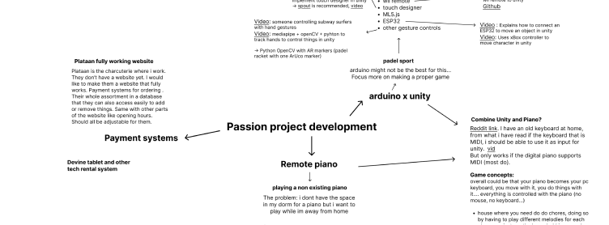
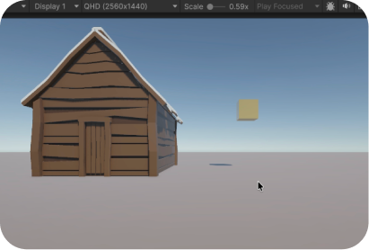
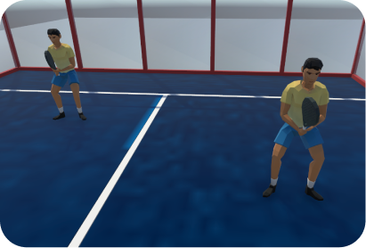
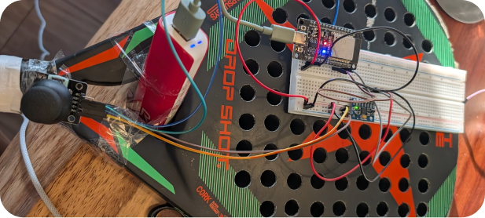
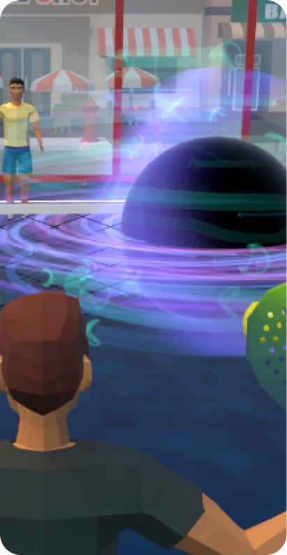
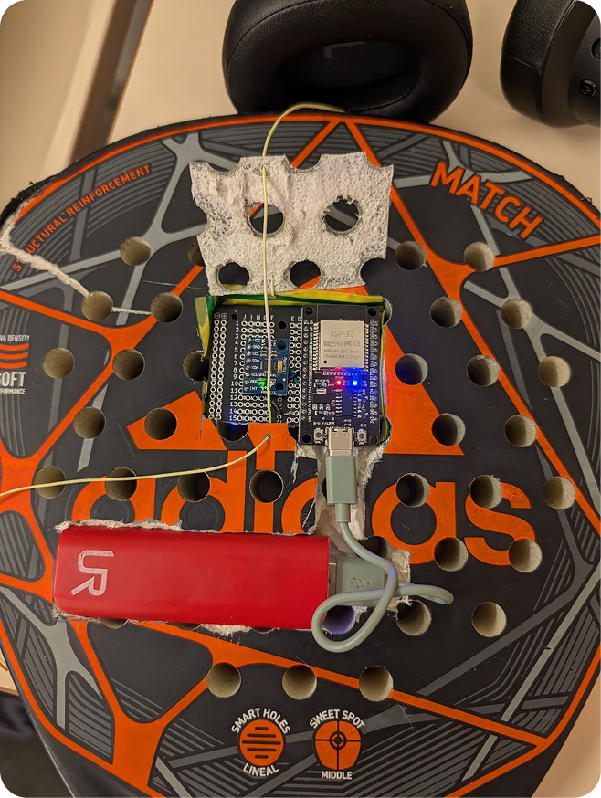
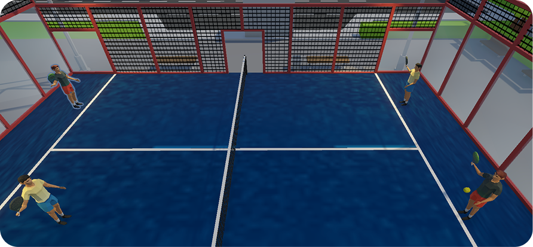
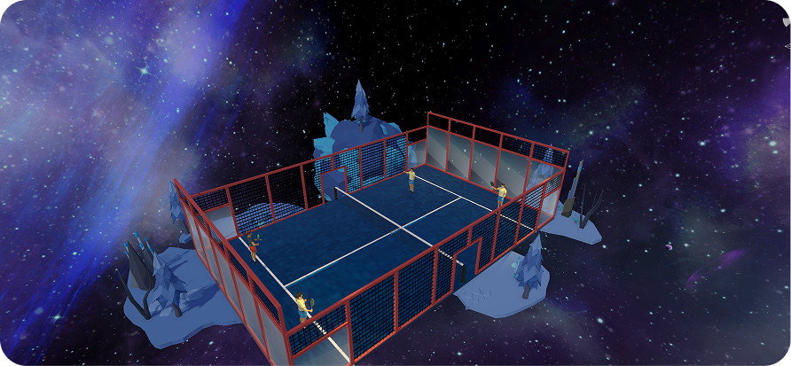

import padelVideo from '../../assets/videos/showcase-padel.mp4?url';
import arrowIcon from "../../assets/icons/arrow-pr-button.svg";

# The briefing

## The challenge 

Make something you are passionate about. We had complete freedom as long as it has to do with development and you learn something new.  

## Extra information

Create your own schedule with milestones, deliverables, expected end results. I was in control of my own planning and had to communicate about it. 

We all got assigned a coach. A teacher we discuss our process with every week. I had to document my work process in detail. Reflect on my choices and alternatives. 

In the final result you show that you explored beyond the knowledge and skills acquired in the curriculum. You should be able to independently learn new knowledge and skills. You experiment within the chosen expertise. You are not afraid to make mistakes and learn from them. You challenge yourself again and again.

# The process

## Ideas

Before the official start on the project, we already had a 2 hour session each week where every one of us would discuss ideas on what we wanted to do for our passion project. 

Since I often make silly browser games for other assignments, I wanted to learn how to make a proper game. Something we also don’t see in our curriculum so I thought it would be perfect to experiment with Unity.,

I brainstormed on ideas for the game and ended up wanting to make something similar like wii tennis but then for padel, and with a twist where all kinds of weird things start happening and the goal is to keep playing. In this stage I also started experimenting with some Youtube tutorials.

## Base game

Before the passion project officially started, I began with some 3D tutorials. At this time, I hadn’t had the lessons on 3D yet but for this game I couldn’t take everything from the Unity asset store, since I could not find things like a padel cage. I created the characters with the rackets, the NPC’s and the padel cage parts in Blender.

Once I had all that, the project was officially on. I started with making the NPC’s play against each other first, so later I could more easily introduce the player. In the beginning I handled it wrong, costing me a lot of time, but it was also a big learning opportunity. I had started with real physics and gravity, making the game unpredictable and almost impossible for me to make it work. 

I took a big leap and restarted on the whole thing. At this point I had a racket with an ESP attached that could roughly detect a swing, a joystick with which you could move the player and a badly working padel game where the ball could make it over the net for a maximum of 1 time. 

As I started over, it had become a lot easier since I had already worked with Unity for a week or two. Instead of physics, I controlled everything. Instead I now used randomised factors and more and with code everything was now decided. The game was now working a lot better! Because of this, I sadly didn’t have time to implement all real life padel plays, but at least the player was able to actually play now!

  ## Space

  

  

  

  I had the idea that after a few points, you would get taken to space and then random things happen that would make it more difficult. 

  Every other point something happens. I created 5 scenarios and one would randomly happen. Like the camera starts moving in circles, you start floating, a black hole appears making the ball disappear and re-appear, ...

  ## Multiplayer
  
  Till now I had one racket with an ESP and an MPU attached that controlled the player (I had removed the joystick and movement was automatic). Now it was time to add in a second player. I duplicated the racket setup and added some extra options to the main menu. I got it working and if you select multiplayer, both the ESP’s will be sending data and each character will listen to the correct one. 

  <a
    class="project__button--content"
    href="https://app.notion.com/p/Blogpost-2a3615fa3a49803191bbdaff47c4b4b5" >
    Full process blog post
    
  </a>

# The result

## Padel game

I am very proud of what I created in just 6 weeks. I learned a lot here and am so glad I ended up with a game that is actually playable! 

You play this game with an actual padel racket. In the rackets are an ESP with a MPU hidden together with a power bank (demo purposes). The ESP and Unity game communicate via the wifi, but with more time i would’ve liked to have done it via bluetooth. 

<video class="padel__video"  controls>
 <source src={padelVideo} />
</video>

  

  

  

  

  

