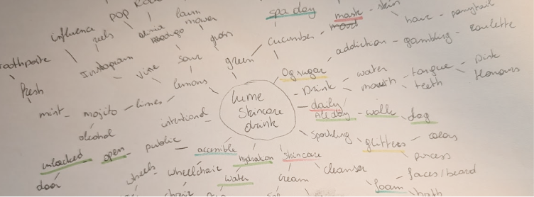
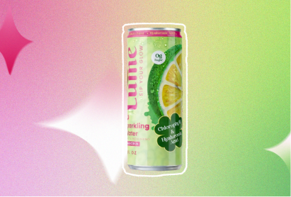
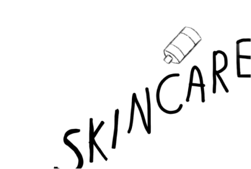
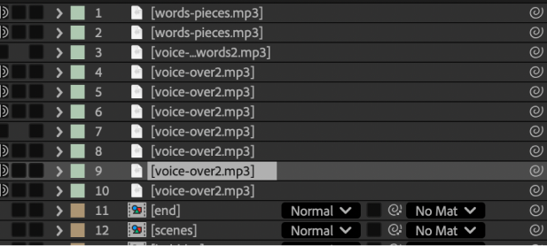
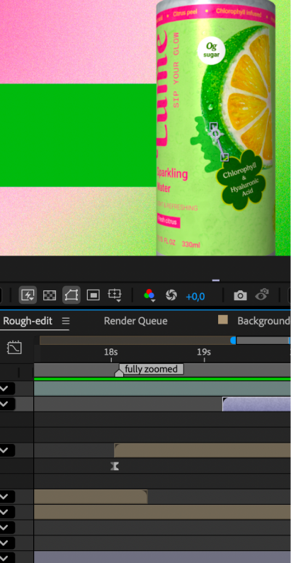

import lumeVideo from '../../assets/videos/Lume-final-video.mp4?url';
import arrowIcon from "../../assets/icons/arrow-pr-button.svg";

# The briefing

This assignment had multiple deadlines. 

## Pitch deck
A PDF file with the client and information, a script for the voice over, a styleboard, storyboards and at least one designed style frame.

## Animatic
After figuring out what the story should be and setting the basics for the project, we needed to make an animatic. A very rough version without design yet that shows the timing.

## Final render

A successful Kickstarter campaign often stands or falls by the way the concept is being sold. Without a visual presentation, it is difficult for a buyer to create a clear image of a product. Look for a Kickstarter campaign without, or with a bad, promo video. My job was to provide a short promo video of their product.

- 1920x1080, 25fps, mp4, H264

- The entire video has audio

- Minimum 30 seconds, maximum 60 seconds

# The process

## Pitch deck

First I needed to find a kickstarted project that I wanted to make a video for. I had a big list but ended up choosing the skincare drink called ‘Lume’. While gathering all the info about the drink, I started brainstorming on a script.

After getting some ideas, I sketched out the first storyboard. With some feedback from my teachers and more iterating, the storyboard was done. Lume already had a bit of styling, so it was a bit easier to create a styleboard. 

## Animatic

Since I was using some text, I though it would be best to draw some frames and bring them into After Effects to then edit them there. I worked 3 hours on just the first part and noticed it really didn’t look nice. So i had to tackle it another way.

Instead of starting with animating in After Effects, i drew each frame individually and then pasted them together in After Effects. After that it was a lot of listening to different songs and voice over’s to find the perfect match.

  ## Final render

  

  

  

  There was one thing I wasn’t sure about when starting on the video. The only images i had of the Lume can where from the front and in my animatic, I had the can turning. I was thinking of using 3D but ended up solving it with the CC cylinder effect and imagining and creating a  full label myself. 

  First I created all the frames in Illustrator so that I could just animate without having to go back and forth. Then I spend some time finding the best noise effect for the video. After that it was just me animating, trying things out and learning new things along the way.

  <a
    class="project__button--content"
    href="https://www.figma.com/design/RwbP1mPDHDSreykltzZXRO/Motion-process?node-id=0-1&t=UPurIftR8IdPKTmR-1" >
    Full process
    
  </a>

# The result

## Final video

The background music includes a watermark, it’s from Premium Beat. Elevenlabs was used for the voice over. You can view the final video here!

  <video class="lume__video" width="1920" height="1080" controls>
  <source src={lumeVideo} />
  </video>

