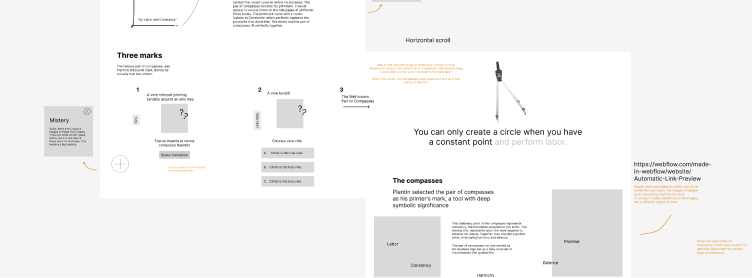
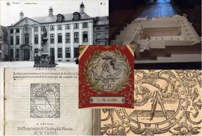
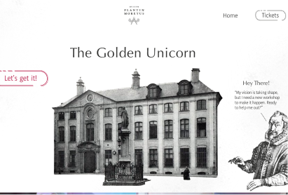
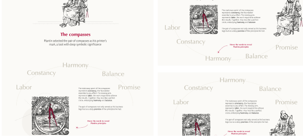
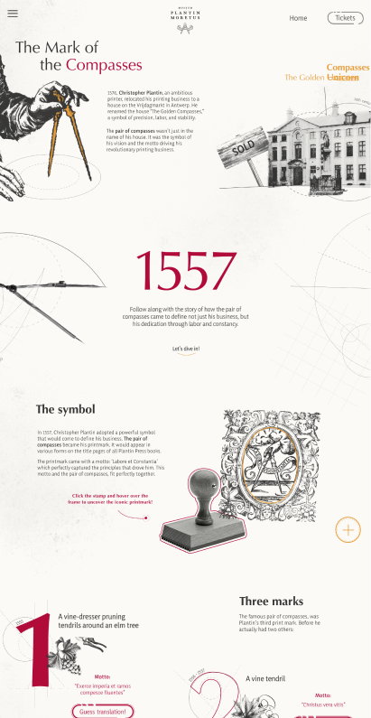
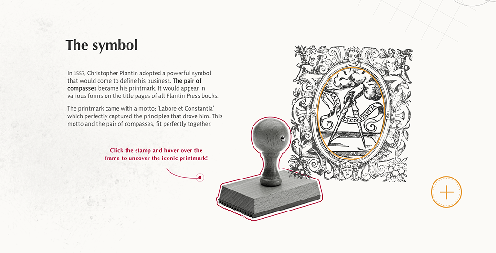
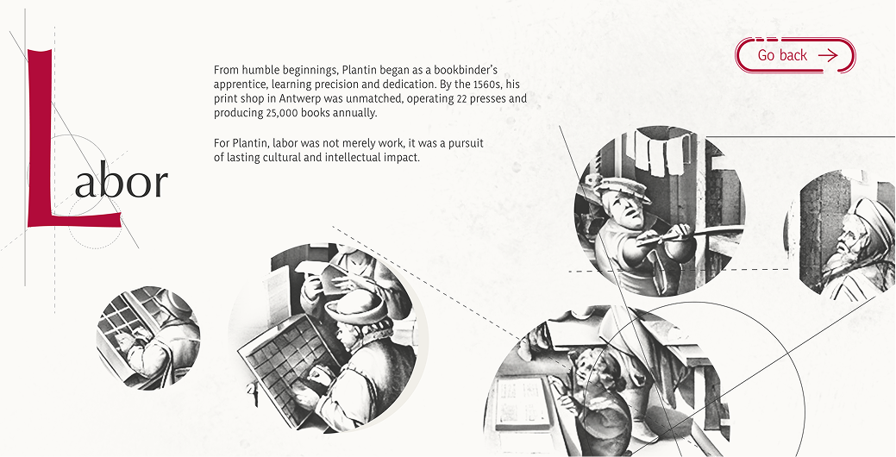

import arrowIcon from "../../assets/icons/arrow-pr-button.svg";

# The briefing

People are often not familiar with the story of Christoffel Plantin. The Plantin-Moretus Museum in Antwerp, is where you can learn all about this family of printers. 

## The goal
Plantin-Moretus wants to focus on a series of stories and history already available on their current website and guided tours, but with a heavy emphasis on storytelling and user experience. The stories need to come alive again, and the modern design should support this. Create an online experience through an interactive story, immersing the reader in a sensory interactive experience. 

## My task
Transform one existing story into a contemporary design and offer a digital experience. The translation should therefore add value to the existing texts/stories and include an element of interactivity.
Every 2 months, one of the stories will be published in the form of a one-pager. You’ve been given the task of creating the first story. 

- Make sure the reader learns by doing.

- This story is a longread, meaning the texts can be a bit longer. After all, we need to tell a story.

- Responsive website

# The process

## Concept

At the beginning, we all went to the museum. Here we could learn all about Plantin. I wrote down everything that caught my eye and took home a small book. It was then time to decide what story I wanted to make a one-pager about.

I had multiple options but eventually went for the mark of the compasses. It wasn’t specifically a whole story in the museum but you could see the compasses everywhere and here and there information about it.

I pieced all the information I could find about the compasses together and started making wireframes. With a lot of fun ideas for interactions and animations I was excited to start designing. 

## Design

With design we had a lot of freedom with the styling, but it should still fit the museum styling and use it’s logo of course. So, I started creating style boards and then once I had one, it was time to design.

The hero image took the longest to figure out, I wanted it to be interactive and help the user immediately dive into the story. So what did I do? Iterate, iterate and iterate! I designed the desktop version first and then designed the mobile version. Afterwards i designed some parts that were a bit more difficult in layout for the tablet size as well. 

  ## Coding

  

  

  

  This was my favorite part of the project, bringing the interaction to life. I created some animations in After Effects, but most were done with GSAP. I had a lot of fun coding and testing this website. Sadly I did run out of time eventually, so I had to simplify one part at the end.  

  As learned, I first coded the mobile version and worked my way up to desktop. This was one of my first websites that I was really proud of. I loved experimenting with all the interactions from pop-ups to quizzes, drag and drops and more. 

# The result

## Website

This website was put online via github pages. This is the story of the compasses. What the pair of compasses meant as a symbol for Christophe Plantin.

  

  

  

  

  <a
  target="_blank"
   class="project__button--content"
   href="https://lizgeerts.github.io/Integration3/" >
   Website
   
  </a>

